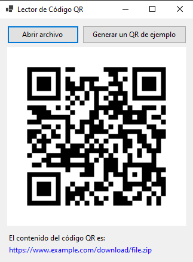

# QR Code Reader App

Esta es una aplicación de lectura de códigos QR que te permite escanear y decodificar códigos QR utilizando la cámara de tu dispositivo. La aplicación está desarrollada en C# utilizando la biblioteca ZXing.

  

## Características

- Escaneo y decodificación de códigos QR en tiempo real.
- Visualización del contenido decodificado del código QR.
- Soporte para abrir enlaces web detectados en el código QR.
- Generación de archivos de imagen QR.

## Requisitos del sistema

- Sistema operativo: Windows 10 o superior.
- .NET 6.0 SDK instalado.

## Instrucciones de uso

1. Ejecuta la aplicación "QR Code Reader".
2. Haz clic en el botón "Seleccionar archivo" para elegir un archivo de imagen que contenga un código QR.
3. Espera a que la aplicación escanee y decodifique el código QR.
4. Si se detecta un enlace web en el código QR, el contenido decodificado se mostrará como un enlace azul. Haz clic en el enlace para abrirlo en tu navegador web.
5. Si no se detecta un enlace web, el contenido decodificado se mostrará en texto simple.
6. Haz clic en el botón "Generar QR" para crear un código QR a partir de un texto ingresado. El archivo de imagen QR se guardará en la ruta de tu elección.

## Contribuciones

¡Las contribuciones son bienvenidas! Si tienes sugerencias, mejoras o encuentras algún problema, no dudes en abrir un issue o enviar un pull request en el repositorio de GitHub.

## Licencia

Este proyecto está bajo la Licencia MIT. Consulta el archivo [LICENSE](LICENSE) para obtener más información.

